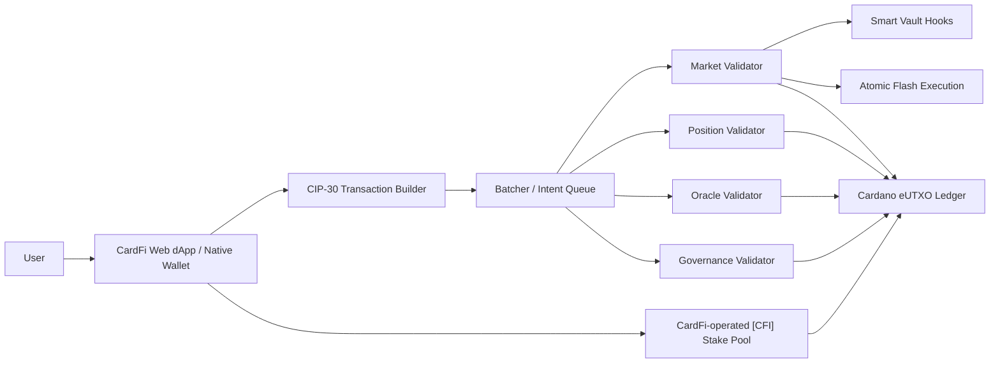

# CardFi

[](https://github.com/doki03164/CARDFI/actions/workflows/ci.yml)

**繁體中文** | [English](#english)

CardFi 是以 Cardano eUTXO 為核心的去中心化借貸與流動性協議展示型產品，整合：

- ADA、DJED、iUSD 與 Cardano Native Tokens 借貸市場
- 借貸抵押與 CardFi 自營 **Cardano 鏈上質押池 `[CFI]`** 的雙軌質押體驗
- ADA 原生 PoS 委託收益與收益型抵押品設計
- 單筆交易原子性的 Flash Execution / Flash Loan
- Smart Vault Hooks：槓桿農場、自動償債、清算防護
- Web dApp、CIP-30 錢包整合與中英雙語介面
- Aiken / Plutus V3 驗證器、Batcher 併發架構與可重現部署清單

> 目前版本是可操作的展示型 MVP 與測試網部署套件。UI 交易採確定性模擬收據；鏈上驗證器已可重現編譯，但 Preprod 提交、端到端鏈上交易、外部審計與主網治理仍是正式發布閘門。

## 快速啟動

需求：Node.js 20+、npm；驗證 Aiken 合約時另需安裝 Aiken CLI。

```powershell
git clone https://github.com/doki03164/CARDFI.git
Set-Location CARDFI
git checkout cardfi-mvp
npm.cmd ci
npm.cmd run dev
```

開啟 `http://127.0.0.1:5173/`。右上角 **EN / 繁中** 可切換語言。

## 已完成的展示功能

| 模組 | 可展示內容 | 現況 |
|---|---|---|
| Markets | Supply、Borrow、利用率、動態利率 | 互動式模擬 |
| Positions | LTV、Health Factor、抵押與債務狀態 | 互動式模擬 |
| Flash Lab | 原子閃電執行、費用與收據 | 互動式模擬 |
| Native Staking | 委託至 CardFi 自營 `[CFI]` 鏈上質押池 | 互動式模擬 + SPO 部署模板 |
| Vault Hooks | Leveraged Farming、Self-Repaying Loan、Liquidation Shield | API/流程展示 |
| Governance | 參數治理、Oracle key rotation | 合約與 UI 展示 |
| Wallet | CIP-30 錢包偵測與連線 | Adapter 已完成 |
| i18n | 繁體中文 / English | 已完成 |

### 兩種「質押」的清楚區分

1. **借貸抵押（Collateral）**：資產鎖入 CardFi 借貸部位，用於計算 LTV 與 Health Factor。
2. **Cardano 原生鏈上質押（Native PoS Delegation）**：CardFi 建置並營運自己的 `[CFI]` Stake Pool；用戶透過 stake credential 委託參與 Cardano PoS。正式產品將以 delegation/stake-right 保留架構，避免把 PoS 委託收益錯寫成協議保證收益。

## 系統架構



### Aiken / Plutus V3 驗證器

| Validator | Hash |
|---|---|
| Governance | `64b0d65a071a3d58052fec7dd569846c43dc4a81d53ad5822010de31` |
| Market | `14c01b4906bbd2c76667d333a9d462ba859b3728651b4c315a413200` |
| Oracle | `6651fbd68f654ba2eed21d6d19dceffcdf73f9930bb42bd93cf2a73f` |
| Position | `1aa0889691276922f22c9dda9c7063da2f322ef4bfd4a3d4a8957f32` |

合約藍圖位於 `contracts/plutus.json`，Preprod 參數與 hash 綁定位於 `deploy/preprod/manifest.json`。

## 驗證專案

```powershell
npm.cmd test
npm.cmd run build
npm.cmd run contracts:check
npm.cmd run contracts:build
npm.cmd run deploy:manifest:check
```

直接使用 Aiken CLI：

```powershell
Set-Location contracts
aiken check
aiken build
```

## 部署展示網站

### GitHub Pages（已提供工作流）

1. Fork 或 clone 本 repo，推送 `cardfi-mvp` 分支。
2. GitHub repo → **Settings → Pages → Source: GitHub Actions**。
3. 前往 **Actions → Deploy CardFi Showcase to GitHub Pages → Run workflow**。
4. 工作流執行測試、以 `/CARDFI/` base path 建置並部署 `dist/`。

工作流：`.github/workflows/pages.yml`。預期網址為 `https://doki03164.github.io/CARDFI/`；只有在 Pages 啟用且工作流成功後才會生效。

### Vercel

- Import `doki03164/CARDFI`
- Branch：`cardfi-mvp`
- Framework：Vite
- Build command：`npm run build`
- Output directory：`dist`

完整本機、GitHub Pages、Vercel、一般靜態主機、Preprod 與 SPO 部署步驟請見 [部署指南](docs/DEPLOYMENT_GUIDE_zh-TW.md)。

## 文件

- [繁體中文：輕量白皮書、10 頁 Pitch Deck、Catalyst 提案](CardFi_Light_Whitepaper_Pitch_Deck_Catalyst_Proposal_zh-TW.md)
- [English: Light Whitepaper, 10-Slide Pitch Deck & Catalyst Proposal](CardFi_Light_Whitepaper_Pitch_Deck_Catalyst_Proposal_EN.md)
- [架構與正式上線邊界](docs/ARCHITECTURE.md)
- [展示操作手冊](docs/SHOWCASE_RUNBOOK.md)
- [部署指南](docs/DEPLOYMENT_GUIDE_zh-TW.md)
- [Catalyst／國庫資金申請指南](docs/FUNDING_APPLICATION_GUIDE_zh-TW.md)
- [CardFi 自營質押池部署手冊](infra/stake-pool/README.md)

## Repository Layout

```text
src/                     React/Vite Web dApp、i18n、協議數學
contracts/               Aiken 合約、測試與 Plutus V3 blueprint
deploy/preprod/           可重現的 Preprod 參數化 manifest
infra/stake-pool/         CardFi [CFI] SPO topology、systemd、metadata
scripts/                  Blueprint、manifest 與驗證工具
docs/                     架構、展示、部署與資金申請文件
.github/workflows/        CI 與 GitHub Pages 部署
```

## 安全與發布邊界

- 所有利率、APY、資產價格與 UI 收據均為展示資料，不構成收益保證。
- 主網前需完成 Oracle freshness/偏差限制、Batcher 容錯、治理 timelock/multisig、端到端交易測試及外部審計。
- Flash Execution 必須在單筆 Cardano 交易中完成借出、策略動作、費用與還款，否則整筆交易驗證失敗。
- SPO 金鑰、KMS/HSM、冷熱節點與監控需依正式營運標準獨立部署，repo 不包含正式私鑰。

---

<a id="english"></a>

# CardFi — English

CardFi is a Cardano-native lending and liquidity protocol showcase combining lending markets, yield-bearing ADA collateral, atomic flash execution, programmable vault hooks, a dedicated wallet experience, and a CardFi-operated native stake pool.

## Quick Start

```bash
git clone https://github.com/doki03164/CARDFI.git
cd CARDFI
git checkout cardfi-mvp
npm ci
npm run dev
```

Open `http://127.0.0.1:5173/` and use the **EN / 繁中** control to switch languages.

## Product Scope

- Lending and borrowing for ADA, DJED, iUSD, and Cardano Native Tokens
- Separate lending collateral and native Cardano PoS delegation flows
- CardFi-operated `[CFI]` stake-pool infrastructure templates
- Atomic flash execution using eUTXO transaction-level validation
- Smart Vault Hooks for leveraged farming, self-repaying loans, and liquidation shielding
- Aiken / Plutus V3 validators with deterministic blueprint and Preprod manifests
- CIP-30 wallet adapter, responsive Web dApp, and bilingual UI

## Test and Build

```bash
npm test
npm run build
npm run contracts:check
npm run contracts:build
npm run deploy:manifest:check
```

## Deploy

For GitHub Pages, select **Settings → Pages → GitHub Actions**, then manually run **Deploy CardFi Showcase to GitHub Pages**. For Vercel, use Vite, `npm run build`, and the `dist` output directory. See the complete [Traditional Chinese deployment guide](docs/DEPLOYMENT_GUIDE_zh-TW.md).

## Project Status

This repository is a testnet-oriented interactive MVP. The user interface produces deterministic demonstration receipts, while the Aiken validators compile reproducibly. Preprod submission, end-to-end on-chain transaction execution, independent security audits, guarded launch controls, and production SPO key operations remain release gates.

## License

Project licensing remains to be finalized by the CardFi entity before external production distribution.
