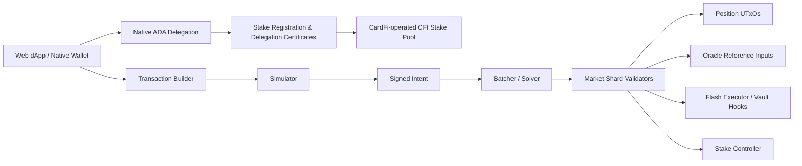

# CardFi MVP Architecture

## MVP boundaries

- The current Web app is an executable product prototype with deterministic protocol math.
- `contracts/` contains the first Aiken state-transition skeleton and invariant tests.
- Wallet signing, indexer, oracle adapters, shard NFTs and live Cardano submission are the next integration gate.

## Two separate staking paths

1. **DeFi collateral:** ADA is spent into a CardFi market/position script UTxO and becomes collateral for borrowing. CardFi must separately account for any staking credential and reward attribution used by script-held ADA.
2. **CardFi native stake pool:** ADA remains spendable in the user's wallet. The wallet signs stake-address registration and delegation certificates for the CardFi-operated `[CFI]` pool. No ADA principal is deposited into CardFi and the Cardano ledger calculates delegator rewards. CardFi operates the block producer, relays, KES/VRF lifecycle, pledge, metadata and monitoring as a separate SPO infrastructure domain.

The UI, transaction builder, accounting and risk disclosures must never merge these two flows. A user may use either or both.

## On-chain invariants

1. Every market transition preserves the shard identity NFT and valid datum schema.
2. Borrowing cannot exceed available liquidity or collateral LTV.
3. A flash transaction must recreate the consumed pool value with principal plus fee.
4. Every borrow/repay consumes and recreates exactly one named position NFT and one market shard; both validators independently enforce the same debt delta and opposite asset flow.
5. Liquidation uses a fresh independent oracle input, never a same-transaction DEX spot price; only positions strictly below the configured threshold are eligible.
6. Liquidation repayment is capped by the configured close factor and seized collateral by the oracle-valued repayment plus configured bonus.
7. A hook is bound to an approved script hash, asset allowlist, maximum slippage and expiry.

The compiled market and position validators now enforce items 1–6: unique continuing outputs, NFT preservation, exact asset and datum transitions, oracle-priced borrowing, atomic flash repayment, synchronized position debt and bounded liquidation.

Oracle valuation is supplied through a unique-NFT reference input whose publisher-signed state thread enforces rational prices, sequence increments and finite validity windows. The market validator binds each borrow/repay redeemer to a named position NFT, owner signature and exact debt transition. The position validator independently requires the corresponding market shard, datum transition and opposite market-asset delta whenever debt changes. Permissionless liquidation now validates oracle freshness, health threshold, close factor, liquidation bonus, collateral seizure, debt reduction and market repayment from both scripts. A governance state thread and transaction-level integration suite are the next contract gates.

## Production services

| Service | Suggested implementation | Purpose |
|---|---|---|
| Web / Wallet | React + TypeScript | User transaction construction and simulation |
| Cardano SDK | Lucid Evolution or Mesh | UTxO query, CBOR build and wallet bridge |
| Indexer | Kupo/Ogmios or provider API | Positions, markets and event history |
| Contracts | Aiken / Plutus V3 | Market, position, oracle, staking and hooks |
| Batcher | TypeScript/Rust workers | Intent batching and shard selection |
| Monitoring | OpenTelemetry + dashboard | Inclusion, contention, oracle and solvency alerts |
