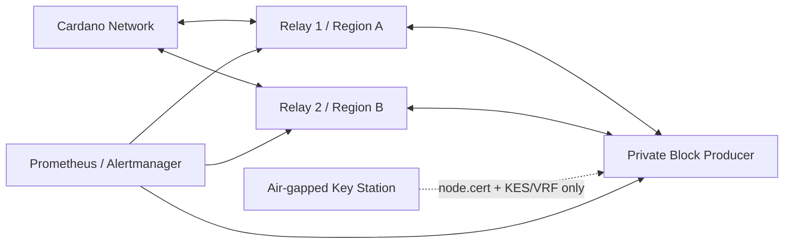

# CardFi Native Stake Pool `[CFI]` — Production Track

此目錄是 CardFi 自營 Cardano 原生鏈上質押池的正式化部署套件。它和借貸抵押合約分開：委託者的 ADA 留在自己的錢包，只把 stake credential 委託給 `[CFI]`。

## 上線策略

```text
Phase S0  本機靜態驗證
Phase S1  Preprod：1 BP + 2 Relays + 離線金鑰 + 鏈上註冊
Phase S2  Preprod 連續運行至少 2 epochs，演練 KES rotation/復原/告警
Phase S3  Mainnet 全新金鑰儀式，硬體錢包或離線簽署，人工放行
Phase S4  `[CFI]` 公開委託與 CardFi Wallet 原生整合
```

Mainnet 不沿用 Preprod 金鑰、錢包、資料庫或憑證。

## 正式拓撲



- Block Producer 沒有公開 Cardano inbound；只與自己的兩台 Relay 通訊。
- Relay 分散在不同供應商或地區，公開 `3001/tcp`。
- `cold.skey`、`cold.counter`、付款與 stake signing keys 永遠留在離線站。
- Block Producer 僅取得 `node.cert`、`vrf.skey`、`kes.skey`；Mainnet 優先升級至 KES Agent。

## 最低主機規格

### Preprod

- 三台 Ubuntu Linux：1 Block Producer、2 Relay
- 每台至少 2 vCPU、4 GB RAM、20 GB SSD；實務建議 8 GB RAM、80 GB SSD
- Relay 需要公開 IPv4、固定 DNS；BP 使用私網 IP

### Mainnet

- 1 BP + 至少 2 Relays，另備監控與離線金鑰站
- 每台至少 2 CPU；建議 24 GB RAM、350–500 GB NVMe
- 穩定頻寬、異地供應商、快照與告警

## 第一次部署：Preprod

### 1. 建立私有環境檔

```bash
cd infra/stake-pool
cp pool.env.example pool.env
chmod 600 pool.env
```

填入：

- `RELAY_1_DNS`、`RELAY_2_DNS`
- 64 字元以內且不 redirect 的 `POOL_METADATA_URL`
- `CARDANO_NODE_VERSION` 與官方 amd64／arm64 release SHA-256（範本目前固定 11.0.1 官方 checksums）
- 合理的 Preprod pledge、margin

正式 metadata 已放在 `public/pool.json`，GitHub Pages 啟用後預期發布至 `https://doki03164.github.io/CARDFI/pool.json`。鏈上註冊前必須確認該網址已生效、沒有 redirect，且 hash 與本機一致。

### 2. 產生並驗證網路設定

在管理用 Linux 主機：

```bash
./scripts/render-config.sh ./pool.env
./scripts/preflight.sh ./pool.env
```

`render-config.sh` 會從 Cardano 官方環境端點下載 config/genesis/topology，逐一做 JSON 檢查並產生 `SHA256SUMS`。BP topology 強制 `useLedgerAfterSlot=-1`、沒有 bootstrap/public peers。

### 3. 安裝兩台 Relay

每台 Relay 的私有 `pool.env`：

```text
NODE_ROLE=relay
```

先把 repo 與 `build/rendered/preprod` 傳入主機，再執行：

```bash
sudo ./scripts/install-host.sh ./pool.env
sudo systemctl start cardano-node
sudo journalctl -u cardano-node -f
```

Relay 防火牆只公開 SSH 管理來源與 `3001/tcp`。Prometheus/Grafana 不直接公開網際網路。

先預覽再套用主機防火牆：

```bash
./scripts/firewall-plan.sh ./pool.env plan
sudo env APPLY_FIREWALL=YES ./scripts/firewall-plan.sh ./pool.env apply
```

### 4. 安裝 Block Producer

BP 的私有 `pool.env`：

```text
NODE_ROLE=block-producer
```

```bash
sudo ./scripts/install-host.sh ./pool.env
```

先保持服務停止。BP 的 `6000/tcp` 只允許兩台 Relay 私網來源；公網不得直接連線。

### 5. 離線金鑰儀式

在斷網 Linux USB／離線電腦安裝同版 `cardano-cli`，將環境檔放在 repo 以外；輸出目錄必須不存在且位於 Git 工作樹外：

```bash
./airgap-key-ceremony.sh /offline/pool.env /offline/cardfi-preprod-keys
```

產出 cold/KES/VRF/payment/stake keys、地址與 pool ID。完成後：

1. 抄錄 `payment.addr`，從 Preprod faucet 取得 test ADA。
2. 將 `cold.skey` 和最新 `cold.counter` 做兩份 age 加密異地備份。
3. 不把任何 `.skey` 放入 Git、雲端同步資料夾或 Relay。

```bash
./backup-cold-keys.sh /offline/cardfi-preprod-keys age1RECIPIENT /media/usb/cardfi-preprod-keys.tar.gz.age
sha256sum --check /media/usb/cardfi-preprod-keys.tar.gz.age.sha256
```

### 6. 建立 Operational Certificate

在已同步的 online node 取得 KES period：

```bash
slotsPerKESPeriod=$(jq -r '.slotsPerKESPeriod' /etc/cardano/shelley-genesis.json)
currentSlot=$(cardano-cli latest query tip --testnet-magic 1 | jq -r '.slot')
echo $((currentSlot / slotsPerKESPeriod))
```

將數字帶回離線站：

```bash
./issue-op-cert.sh /offline/cardfi-preprod-keys KES_PERIOD /offline/hot-transfer
```

把 `hot-transfer` 經加密媒體送至 BP，然後：

```bash
sudo ./scripts/install-hot-credentials.sh ./pool.env /secure/hot-transfer
sudo systemctl start cardano-node
./scripts/health-check.sh ./pool.env
```

### 7. 建立池註冊交易

Online node 準備不可變上下文：

```bash
./scripts/prepare-registration-online.sh ./pool.env ./build/registration-context
```

將 context 帶到離線站並產生 pool/stake/delegation certificates：

```bash
./register-pool.sh /offline/pool.env /offline/registration-context /offline/cardfi-preprod-keys /offline/certificates
```

把 certificates 帶回 online node，建立 unsigned transaction：

```bash
./scripts/build-registration-tx.sh ./pool.env /secure/certificates ./build/registration-tx
cat ./build/registration-tx/tx.view.txt
```

確認 pledge、deposit、fee、change address 與有效期後，把 `tx.raw` 帶到離線站：

```bash
./airgap-sign-registration.sh /offline/pool.env /offline/tx.raw /offline/cardfi-preprod-keys /offline/tx.signed
```

將簽署結果帶回 online node：

```bash
./scripts/submit-registration.sh ./pool.env ./build/tx.signed
./scripts/verify-onchain.sh ./pool.env ./public/cold.vkey ./public/stake.addr
```

提交前的最後人工閘門：公開 metadata hash 必須相同、Pool ID 正確、付款輸入只來自營運地址、change 回到同一地址。

## 維運要求

- 每日：service、sync、peer、磁碟、錯誤率、區塊高度。
- 每 epoch：pool stake snapshot、assigned/minted/missed slots、成本與獎勵。
- KES：提前 14 天告警並演練 rotation；永遠使用最新 `cold.counter`。
- 每月：還原一份離線備份到隔離機並驗證 hash，不啟動簽署。
- 升級：先 Relay 1、觀察、Relay 2、觀察，最後 BP；保留舊 binary 與 config 回滾。
- Preprod 至少連續通過兩個 epoch，再召開 Mainnet go/no-go review。

Prometheus 初始規則位於 `monitoring/prometheus-alerts.yml`。

## 驗證

Windows repo 靜態檢查：

```powershell
./scripts/verify-templates.ps1
```

Linux 節點執行：

```bash
./scripts/preflight.sh ./pool.env
./scripts/health-check.sh ./pool.env
./scripts/verify-onchain.sh ./pool.env /public/cold.vkey /public/stake.addr
```

## 安全紅線

- Repo、GitHub Actions、OneDrive、Relay、監控主機不得出現 `.skey`。
- Mainnet raw-key 腳本預設鎖定；正式 pledge/payment 建議硬體錢包或可恢復的離線 mnemonic 流程。
- BP 位址不放進 pool registration，也不讓 ledger peer discovery 暴露。
- 不使用未驗證 SHA-256 的 cardano-node binary。
- 不在尚未同步的節點計算 KES period、建交易或判斷鏈上狀態。
