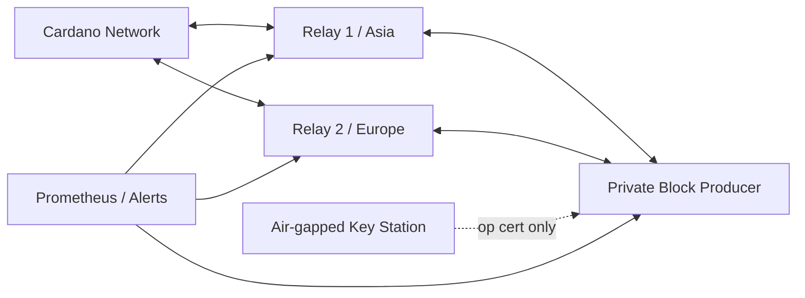

# CardFi Native Stake Pool `[CFI]`

This directory is the deployment baseline for a CardFi-operated Cardano stake pool. It is separate from the CardFi lending contracts.

## Target topology



- One private block producer; no inbound public exposure.
- Two public relays on different providers/regions.
- Cold signing key and counter remain on an air-gapped machine.
- Only KES, VRF and operational certificate reach the producer. Prefer a KES agent for production.
- Pool metadata is hosted over HTTPS and its hash is committed in the registration certificate.

## Current state

| Layer | State |
|---|---|
| Topology templates | Ready |
| systemd service templates | Ready |
| Metadata and registration script | Ready with typed placeholders |
| Real servers, DNS and TLS | `HOST_RELAY_1`, `HOST_RELAY_2`, `HOST_BP` pending |
| Cold/KES/VRF keys | Must be generated during an air-gapped ceremony |
| Preprod registration | Pending funded test wallet and provider endpoints |
| Mainnet registration | After Preprod burn-in and operator review |

## Deployment order

1. Copy `pool.env.example` to a private operator environment and fill all placeholders.
2. Provision the two relays and block producer on independent hosts.
3. Install the pinned `cardano-node` and `cardano-cli` release on every node.
4. Sync relays first, then sync the block producer through only those relays.
5. On the air-gapped host, generate cold, VRF and KES material and issue the op cert.
6. Move only `node.cert`, `vrf.skey` and `kes.skey` to `/run/secrets` on the producer; keep `cold.skey` and `cold.counter` offline.
7. Publish `metadata/poolMetaData.json` via HTTPS and calculate its hash.
8. Run the registration script on Preprod; delegate the pledge address to the new pool.
9. Monitor sync, peer count, KES period, missed slots and block propagation for at least two epochs.
10. Repeat the ceremony for mainnet using new, network-specific keys and explicit operator approval.

## Security gates

- Never generate or commit live signing keys in this repository.
- Never expose the block-producer port to the public internet.
- Keep payment keys separate from node keys.
- Store encrypted cold-key backups in at least two physically separate locations.
- Rotate KES/op-cert before expiry and always use the latest `cold.counter`.
- Use a DNS name for each relay and monitor pool retirement/metadata state.

## Verification

```powershell
./scripts/verify-templates.ps1
```

Production commands must run on the target Linux hosts with current protocol parameters. Values such as minimum pool cost are queried from the ledger at registration time rather than hard-coded.
